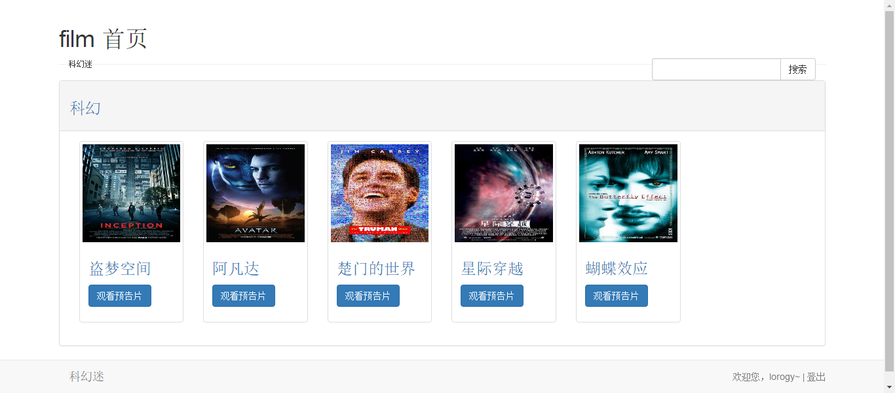
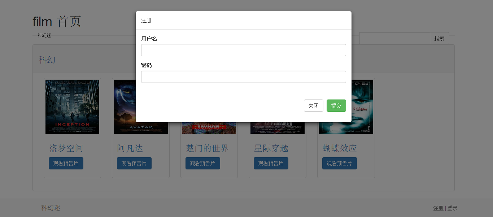
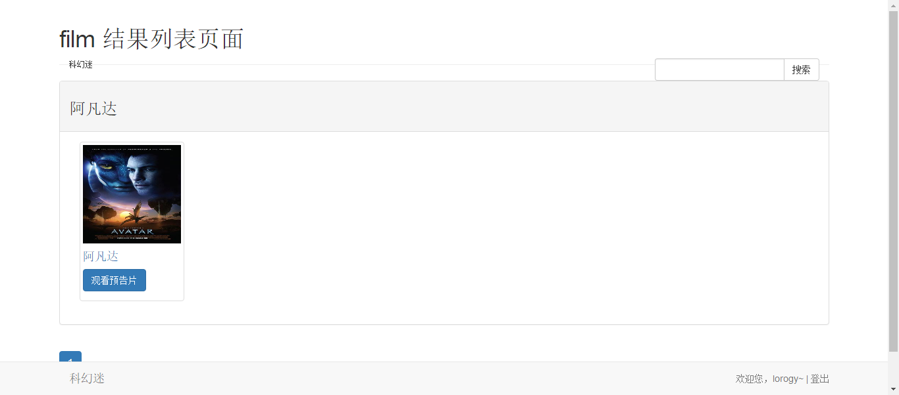
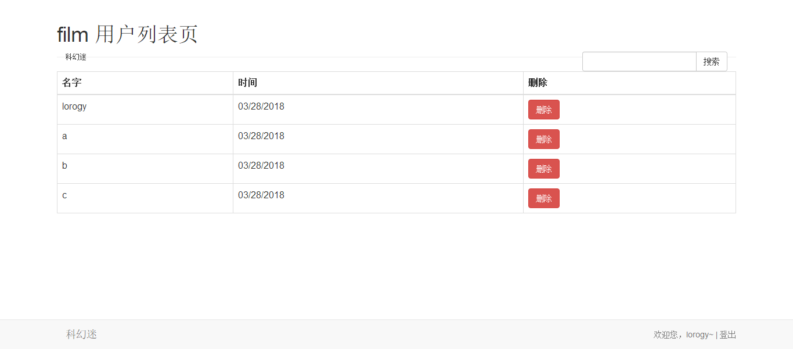
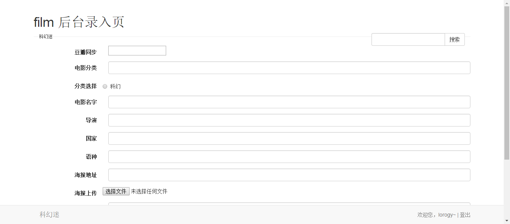
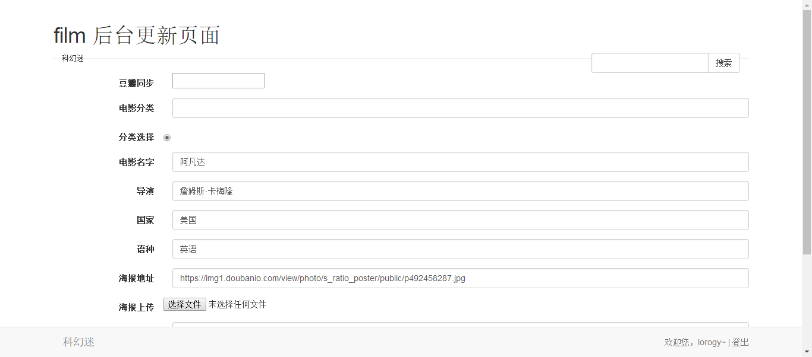
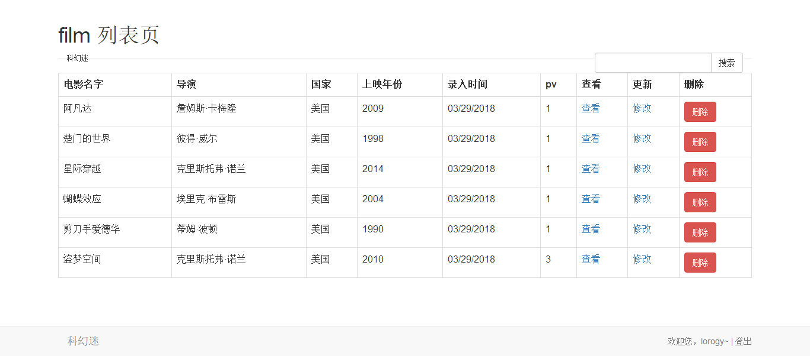
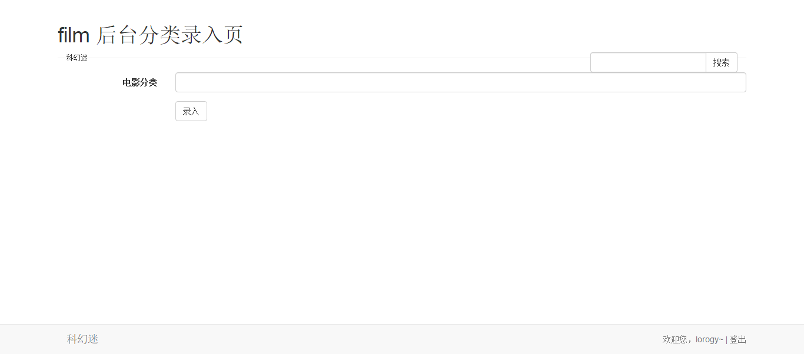
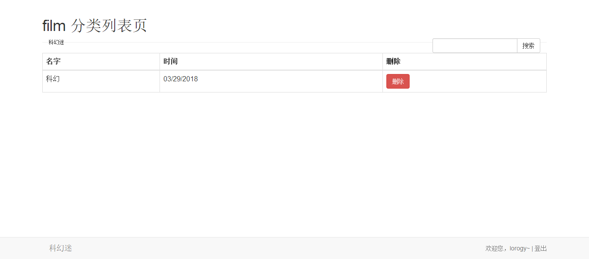

# film-website-demo

> A node&mongodb project for film-website

> https://github.com/Lorogy/film-website-demo.git

## 使用
1.环境要求  
mongodb、git、nodejs、express、bower  
2.安装依赖  
`cnpm install`  
3.安装静态资源  
`bower install jquery --save`  
`bower install bootstrap --save`  
4.运行  
`node app.js`  
5.调试  
`grunt`  
`grunt default`  

## 相关插件
nodejs express  
jade 模板引擎  
bower 安装jQuery与bootstrap  
moment.js 时间格式化  
mongodb mongoose 数据库  
bcrypt 密码存储加密，加盐  

## grunt插件
grunt-contrib-watch 实时监听各类文件变化  
grunt-nodemon 实时监听入口文件app.js  
grunt-concurrent 针对慢任务优化构建时间，跑多个组件任务  

## 文件
app.js 入口文件  
app/views/ 视图文件  
app/schemas/ 数据库模式  
app/models/ 数据库模型  
app/controllers/ 相关方法封装，用于中间件  
config/ 路由配置封装  
document/ 文档  
public/build/ 编译压缩后的js、cssw文件  
public/js/ js文件  
public/less/ less文件  
public/libs/ bower安装的静态资源  
public/js/ js相关文件  

## 项目展示
### 普通用户

主页   
详情页   
注册页   
登录页   
结果查询页   

### 后台管理

用户列表   
后台录入   
后台更新   
电影列表   
分类增加   
分类列表   

## 接口
localhost:3000  
### 前端（get）

- / 首页  
- /signup 注册页面  
- /signin 登录页面  
- /logout 登出  
- /movie/:id 详情页面  
- /results 查询结果页面  

### 后端(需要权限)
post  

- /user/signup 用户注册接口  
- /user/signin 用户登录接口  
- /admin/movie 电影数据接口，需要管理员权限  
- /user/comment 评论接口，需要用户权限  
- /admin/category 电影分类接口，需要管理员权限  

get  

- /admin/user/list 用户列表页面，需要管理员权限  
- /admin/movie/new 后台录入页面，需要管理员权限  
- /admin/movie/update/:id 后台更新页面，需要管理员权限  
- /admin/movie/list 电影列表页面，需要管理员权限  
- /admin/category/new 分类增加页面，需要管理员权限  
- /admin/category/list 分类列表页面，需要管理员权限  

delete  

- /admin/movie/list 删除一条电影数据，需要管理员权限  

